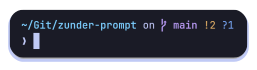

# ⚡ zunder-prompt

Simple and fast zsh prompt based on [gitstatus](https://github.com/romkatv/gitstatus).



> [!IMPORTANT]
> gitstatus officially went on life support on June 6, 2024, although it is
> working properly as of today and will probably do so for an almost indefinite
> period of time.

## Why? 🤔

I oscillated between **Starship** and **Powerlevel10k** for my zsh prompt.
**Starship** is customizable and visually appealing by default but has
unnecessary features, making it slower. **Powerlevel10k** is extremely fast but
has a complex configuration.

My goal was to create a prompt with only the **essential functionality**:
detecting command failures and displaying basic git repository info. I avoided
advanced customization to keep the code simple yet aesthetically pleasing.

**Zunder-prompt** combines Starship's style and Powerlevel10k's efficiency. It
uses **gitstatus** (like Powerlevel10k) for optimized git info, ensuring
**instant responsiveness** with no lag.

## Installation ⚙️

### [Zinit](https://github.com/zdharma-continuum/zinit)

```sh
zinit light-mode depth"1" for \
  romkatv/gitstatus \
  warbacon/zunder-prompt
```

### [Zap](https://github.com/zap-zsh/zap)

```sh
plug "romkatv/gitstatus"
plug "warbacon/zunder-prompt"
```

### [Zgenom](https://github.com/jandamm/zgenom)

```sh
if ! zgenom saved; then
  # ...
  zgenom load romkatv/gitstatus
  zgenom load warbacon/zunder-prompt
  # ...
fi
```

### [Zplug](https://github.com/zplug/zplug)

```sh
zplug "romkatv/gitstatus", depth:1
zplug "warbacon/zunder-prompt", on:"romkatv/gitstatus", depth=1
```

## Customization 🎨

As zunder-prompt is built with simplicity and speed in mind, there isn't too
much customization available. However, you can change the prompt's character
symbol and color.

```sh
ZUNDER_PROMPT_CHAR="➜"              # default value: "❯"

ZUNDER_PROMPT_CHAR_COLOR="green"    # default value: "fg"
```

## Thanks to

- [romkatv](https://github.com/romkatv) for gitsatus.
- [Starship](https://starship.rs/) for inspiration.
